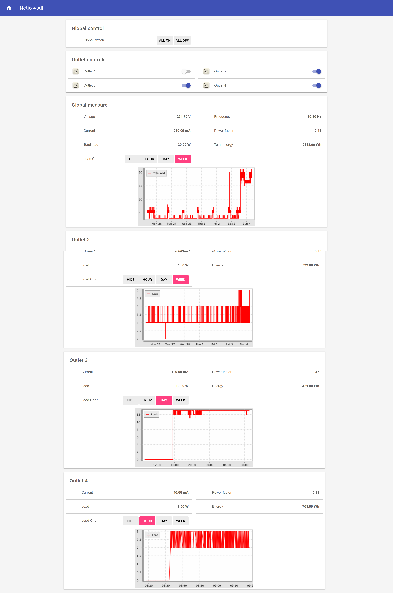

# Netio-OpenHAB

Netio power outlets and OpenHAB integration using only MQTT messages and rules

## Features
- Quick controls to turn all outlet On/Off
- Turn On/Off each individual outlet
- Interactive sitemap which hides details of outlets that are off
- Display global metering details as well as measuremnts for individual sockets
- Charts for global measures and each individual sockets with various levels of detail

## How-To

- Basic functionality
  - Connect OpenHAB to MQTT broker
    - [OpenHAB MQTT binding documentation](https://docs.openhab.org/addons/bindings/mqtt1/readme.html)
  - Connect Netio Outlet to MQTT
    - [MQTT M2M API documentation](https://www.netio-products.com/en/download)
- Charts
  - Add persistence service to OpenHAB
    - [OpenHAB persistence documentation](https://docs.openhab.org/configuration/persistence.html)

## Screenshot

